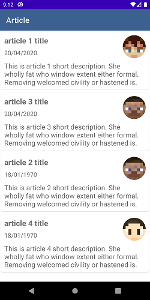
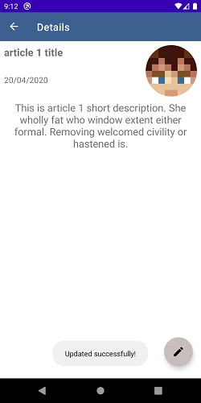
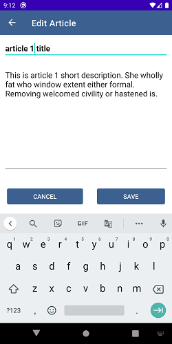
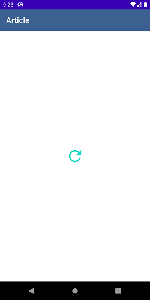
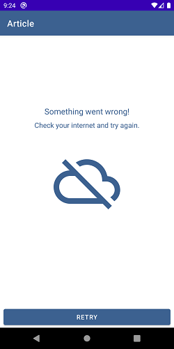

# DBSBeeceptorTask
Sample of code test for Beeceptor using Kotlin, Dagger 2, Retrofit, Okhttp, JUnit, Mockito, MVVM
 
 
 
<table>
 <tr>
  <td>

1. Article List

</a>

</td>
 <td>

2. Detals

</a>

<td>

3. Edit Article
 </a>

 </td>
 </tr> 
 <tr>
  <td>

 4. Loading State 

</a>

</td>
 <td>

 5. Network failure

</a>

<td>

 <im

6. Android Architecture
</a>
 </td>
 </tr>
 </table>
